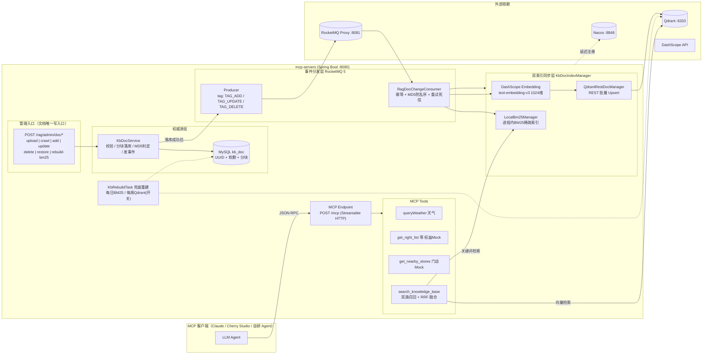

# mcp-servers — 事件驱动双索引 RAG 知识库 + MCP 工具服务器

[]() []() []() []() []() []()

> **一句话定位**：基于 Spring Boot 3 + Spring AI MCP 构建的工具服务器，核心是一座**事件驱动的健康科普 RAG 知识库**——以 MySQL 为唯一权威源，经 RocketMQ 事件驱动 **Qdrant 稠密向量 + 进程内 BM25 稀疏关键词** 双索引秒级同步；检索时**双路召回 + RRF 融合排序 + 故障自动降级**，并通过**定时全量重建**实现最终一致闭环。

---

## 1. 核心亮点速览

### 1.1 技术完整度 —— 生产级 RAG 全链路，一个不缺

| 环节 | 本项目实现 | 完成度 |
| --- | --- | --- |
| 文档接入 | PDF（PDFBox）/ MD / TXT 上传、jsoup 网页抓取去噪、粘贴文本，三种入口 | ✅ |
| 权威源存储 | MySQL `kb_doc` 分块存储、UUID 主键贯穿全链路、软删除 + 恢复、MD5 变更判定 | ✅ |
| 异步索引同步 | RocketMQ 5 事件驱动（ADD / UPDATE / DELETE），tag 隔离新旧链路 | ✅ |
| 稠密索引 | Qdrant REST 直连，1024 维 Cosine，批量 upsert，filtered HNSW 分组检索 | ✅ |
| 稀疏索引 | **进程内 BM25 引擎**（倒排表 + 中英混合 bigram 分词 + BM25 打分） | ✅ 自研 |
| 检索融合 | 双路并行召回 → RRF（k=60）融合 → TopK，任一路故障自动降级 | ✅ |
| 可靠性 | 双层幂等 + 乱序防护（MD5 二次比对）+ 重试死信 + 定时全量重建兜底 | ✅ |
| 管理后台 | 文档分页/筛选/搜索、上传/抓取/粘贴、编辑、软删、恢复、手动重建 | ✅ |
| MCP 协议 | Streamable HTTP 单端点、注解式工具、结构化返回、工具 annotations | ✅ |
| 质量保障 | 11 个纯 Mock 单测覆盖 RRF 融合、降级容错、TopK 边界、分词、索引重建 | ✅ |

### 1.2 创新点 —— 五个区别于「Demo 级 RAG」的设计

1. **权威源事件驱动架构**：所有写操作只落 MySQL 权威源，业务层**无权指定事件类型**——落库后按「存在性 + MD5 变化」自动判定 ADD / UPDATE 并发事件，从机制上杜绝「内容没变也广播重建」与「多入口直写索引造成数据漂移」两类经典问题；
2. **三方 ID 对齐的确定性分块**：`ChunkSplitter` 作为分块单一来源，权威源行 `chunk_id`、Qdrant `point id`（`docId_序号`）、BM25 索引 key **三方严格对齐**——这是双路召回结果能按*片段级*融合（而非文档级粗对齐）的前提；
3. **零依赖进程内 BM25 引擎**：不引入 Elasticsearch / Lucene，纯 JDK 实现倒排表 + BM25（k1=1.2, b=0.75）+ 中文 bigram / 英文词元混合分词 + 分组过滤（IDF 保持全库计算），关键词召回**零部署成本、内存级响应**；
4. **MD5 乱序防护**：消费端处理前将消息 MD5 与权威源实时比对，乱序到达的旧消息直接跳过（`SkipMessageException` 主动 ack），以轻量方案替代「FIFO 顺序消息」（存量 NORMAL topic 无需迁移重建）；
5. **差异化事务策略**：ADD 事件发送失败**回滚落库**（严格一致，客户端可安全重传）；UPDATE 发送失败**不回滚**权威源（告警日志 + 定时重建收敛）——按业务语义选择一致性强度，而非教条式强一致。

### 1.3 优势点 —— 为什么这套方案值得参考

- **检索质量**：语义（向量）与字面（BM25）互补，RRF 融合让「双路命中」片段天然排前；专业术语、药品名等字面精确匹配场景不受 embedding 语义漂移影响；
- **可用性**：检索双路独立、单路故障秒级降级且**输出中明示降级状态**；Qdrant / Nacos / MQ 任一依赖不可用均**不阻断应用启动**；
- **一致性**：四层防线（单入口写源 → 事件驱动增量同步 → 死信告警 → 定时全量重建）保证「最终必然一致」——索引只是加速结构，MySQL 永远是真相；
- **成本**：BM25 进程内实现省去一套 ES 集群；Qdrant REST 直连零 SDK 依赖；向量化在消费端异步发生，上传接口响应快；
- **可运维**：六分组业务域贯穿全链路（Qdrant filtered HNSW 前置过滤，检索空间最小化）；`rebuild-bm25` 与 Qdrant 重灌开关支持随时人工对齐索引；关键路径全量结构化日志与命中溯源。

---

## 2. 整体架构



### 两条核心数据流

**① 摄入流（变更秒级可见）**

```text
上传/抓取/粘贴 → 解析纯文本 → KbDocService 落库（分块 500/100 + 整篇 MD5）
  → 判定事件类型 → RocketMQ（tag = TAG_ADD / TAG_UPDATE / TAG_DELETE）
  → 消费端：msg_id 幂等去重 + 消息 MD5 与权威源比对（防乱序旧消息覆盖）
  → ① BM25 增量追加（关键词路即刻可检索）
  → ② DashScope 逐块向量化 → Qdrant 批量 upsert（语义路可检索）
```

**② 检索流（双路容错）**

```text
用户问题 → [向量路]  embed → Qdrant filtered HNSW Top10（可按六分组过滤）
         → [关键词路] BM25 Top10（同分组过滤，IDF 按全库计算）
         → 任一路失败自动降级单路（输出中明示降级提示）
         → RRF 融合：score(d) = Σ 1/(60 + rank)，双路命中者天然领先
         → TopK（默认 3，上限 5）→ 拼装上下文 + 命中溯源信息返回 LLM
```

---

## 3. 核心技术方案详解

### 3.1 权威源设计 —— 「先落库、后判型、再发事件」

**表结构**（`schema.sql`，每行 = 一个文档分块）：

| 字段 | 类型 | 设计意图 |
| --- | --- | --- |
| `doc_id` | VARCHAR(64) | 上传时生成的 UUID，**全链路唯一、编辑/删除永不变**——作为 MQ 分区语义键、BM25 docId、Qdrant payload 过滤键 |
| `doc_group` | VARCHAR(32) | 六分组业务域，贯穿权威源 → MQ 消息 → BM25 → Qdrant payload → 检索过滤 |
| `content` | LONGTEXT | 分块正文（500 字符/块） |
| `chunk_id` | INT | 分块序号，分块唯一 ID = `doc_id + "_" + chunk_id` |
| `content_md5` | CHAR(32) | **整篇正文 MD5**（同文档所有块相同），变更判定 + 消费端乱序防护的双重依据 |
| `status` | TINYINT | 软删除标记（1 有效 / 0 已删），支撑恢复与全量重建跳过 |

**写路径规则**（`KbDocService` 是权威源唯一写入口）：

1. **上传**：生成 UUID → 分块落库 → 发 `ADD` 事件；**MQ 发送失败则回滚刚插入的行**并抛错（调用方可安全重传，绝不产生「有库无索引」的脏状态）；
2. **编辑**：整篇 MD5 / 标题 / 分组**任一变化**才物理删旧行、插新行并发 `UPDATE`；完全无变化则**不发消息**（杜绝无效广播）；UPDATE 事件发送失败**不回滚**（权威源已最新，记告警日志等待定时重建收敛索引）；
3. **删除**：软删除（status=0）→ 发 `DELETE`；**恢复**：status 重置 1 → 重发 `ADD`（消费端按权威源当前内容重建双索引）。

> 设计收益：事件类型由「数据事实」推导而非人工指定，任何调用方都无法绕过判定逻辑，从源头保证事件流与权威源一致。

### 3.2 双索引同步 —— 稠密 + 稀疏，一套事件驱动两路写入

`KbDocIndexManager` 消费 `ADD / UPDATE / DELETE` 三类事件：

| 事件 | 处理逻辑 |
| --- | --- |
| ADD | `ChunkSplitter.split(500, 100)` → **BM25 先写**（关键词路即刻可检索，不依赖 embedding）→ 逐块 DashScope 向量化 → Qdrant 批量 upsert |
| UPDATE | 按 docId 删双索引旧数据 → 走 ADD 重写（替换式更新，适配分块数变化） |
| DELETE | Qdrant filter 删点 + BM25 按 docId 移除（进程内即时生效，**秒级不可检索**） |

**point id 规范**：`docId_chunkIdx`，与权威源 `kb_doc` 行、BM25 索引 key 三方对齐。`ChunkSplitter` 被落库与消费端**共用**（确定性分块），即使消息重放，重新分块结果也逐字节一致，天然幂等。

### 3.3 进程内 BM25 引擎 —— 零依赖的稀疏检索（自研亮点）

`LocalBm25Manager` 用约 300 行纯 JDK 实现完整 BM25 检索：

- **中英混合分词**：中文按滑动二元组（bigram，「感冒症状」→「感冒/冒症/症状」），英文/数字连续段为词元，统一小写归一化——无需词典与分词模型，对中文健康科普语料召回效果稳定；
- **打分公式**：标准 BM25（k1=1.2, b=0.75），`IDF = ln(1 + (N - df + 0.5)/(df + 0.5))`，含文档长度归一化；
- **分组过滤**：命中片段按 `docGroup` 过滤，但 **IDF 保持全库统计**——过滤子集内罕见词的区分度不被稀释；
- **零停机重建**：`synchronized` 锁内清空重灌 + 重算全局统计，重建期间读操作走锁外快照语义，不阻塞检索；
- **多源构建**：启动时优先从权威源 MySQL 构建；权威源为空（新库上线）自动回退从 Qdrant scroll 全量构建；两者都失败仅告警不阻断启动，可随时 `POST /rag/admin/doc/rebuild-bm25` 手动对齐。

### 3.4 多路召回 + RRF 融合 —— 检索质量与容错兼得

`RagTool.searchKnowledgeBase`（MCP 工具 `search_knowledge_base`）：

1. **双路并行**：向量路（DashScope embed → Qdrant filtered HNSW Top10）与关键词路（BM25 Top10）各自独立 try/catch；
2. **自动降级**：任一路异常仅置失败标记，另一路照常返回，且**输出头部明示**「向量召回暂不可用，本次仅 BM25 关键词召回」；双路皆挂才返回友好提示，**永不向 LLM 抛异常**；
3. **RRF 融合**：`score(d) = Σ 1/(k + rank_i(d))`，k=60（学界标准值）。按 pointId 对齐两路排名后累加——**同时在两路出现的片段得分天然翻倍领先**；单路独有的结果仍保留；
4. **命中溯源**：每条结果标注 RRF 得分、向量分、BM25 分、命中来源（向量/关键词/向量+关键词）、分组、文档来源，LLM 与运维均可解释；
5. **参数防御**：topK 非法重置默认 3、上限 5；docGroup 白名单校验（六分组枚举）；空白查询直接拦截。

### 3.5 分组维度检索 —— 六分组贯穿全链路

`DocGroupEnum`（cardio_health 心血管 / resp_health 呼吸 / ped_health 儿童健康 / endo_health 内分泌 / women_health 女性健康 / common_living 通用居家健康）：

- 上传必选（下拉六选一）→ 写入权威源、MQ 消息、BM25 索引、Qdrant payload；
- 检索时 Qdrant 执行 **filtered HNSW**（先按 `docGroup` payload 过滤缩小候选集，再图遍历），跨分组零串扰；
- BM25 侧对命中片段做同分组过滤（IDF 全库计算，见 3.3）。

### 3.6 数据一致性保障 —— 四层防线收敛一切异常

| 防线 | 机制 | 拦截的异常 |
| --- | --- | --- |
| ① 单入口写源 | 所有变更仅经 `KbDocService` 写 MySQL + 发 MQ，无第二写路径 | 多入口直写索引导致的数据漂移 |
| ② 双层幂等 | `msg_id` 内存去重（容量 10 万自动清空）+ **消息 MD5 与权威源实时比对** | 消息重复投递、重试产生的重复索引 |
| ③ MD5 乱序防护 | 比对不一致 / 权威源已软删的消息抛 `SkipMessageException` 主动跳过（ack 不重试） | 乱序到达的旧消息覆盖新内容；已删文档被旧消息复活 |
| ④ 重试 + 死信 + 全量重建 | 消费失败不 ack → 30s 不可见超时自动重投 → 超过 3 次进死信告警日志；**每日凌晨 3 点 BM25 从权威源全量重建**、**每周日凌晨 4:30 Qdrant 全量重灌（开关控制，默认关）** | 死信遗漏、长期索引碎片、HNSW 图退化 |

> 核心哲学：**索引只是可再生的加速结构**——任何消息层无法兜住的偏差，最终都会被定时全量重建从权威源修正回来，实现「最终必然一致」。

### 3.7 RocketMQ 5 消费模板 —— 模板方法模式封装全部基础设施

`BaseConsumer<T>` 基于 rocketmq-client-java 5.x `SimpleConsumer` 拉模式抽象出通用骨架，子类只需实现 5 个业务方法（消息类型 / topic / group / 端点 / consume）：

- **拉取循环**：单线程 `receive(batch, 30s)`，空转 continue，异常捕获不退出；
- **生命周期**：`ConsumerStarter` 监听容器 `ContextRefreshedEvent / ContextClosedEvent` 统一 init / destroy，**单个消费者初始化失败只记日志，不拖垮整个应用启动**；
- **重试语义**：失败不 ack → broker 按不可见时间 30s 自动重投；`deliveryAttempt` 超过 3 次 → 死信钩子 + ack；
- **扩展点**：`preFilter`（前置过滤）、`idempotentCheck / markIdempotent`（幂等）、`handleDeadLetter`（死信告警）、`onConsumeSuccess/Fail`（结果回调）、`SkipMessageException`（业务性跳过，直接 ack 不重试）；
- **新旧链路共存**：同 topic `doc_chunk_vector_topic` 通过 tag 隔离——`TAG_ADD || TAG_UPDATE || TAG_DELETE` 为文档事件链路，`vector_write` 为存量块级写入链路（`DocVectorQdrantConsumer` 保留消费存量消息，批量缓冲 20 条 / 1 秒聚合刷盘 + 失败逐条重试三层兜底）。

### 3.8 MCP Server 落地 —— Streamable HTTP + 注解式工具

- **传输协议**：Streamable HTTP（MCP 新一代传输），单端点 `POST /mcp` 承载全部 JSON-RPC 请求，替代旧 SSE 双端点方案；keep-alive 30s；
- **注解式开发**：`@McpTool` / `@McpToolParam` 注解在普通 Spring Bean 方法上即声明工具，框架自动生成 JSON Schema 与工具元数据，新增工具零样板代码；
- **语义化工具描述**：`search_knowledge_base` 的 description 明确「仅用于健康科普场景、超出范围不要调用、不要编造知识库外的医学内容」，从协议层约束 LLM 的工具选择与幻觉边界；
- **工具 annotations**：`readOnlyHint=true / destructiveHint=false / idempotentHint=true`，向客户端声明只读幂等属性；
- **结构化返回**：`McpSchema.CallToolResult` 同时携带 text 与 structuredContent（权益/门店工具），适配不同客户端渲染能力。

### 3.9 工程细节 —— 踩坑沉淀的生产级处理

| 问题 | 方案 | 位置 |
| --- | --- | --- |
| Nacos Client 启动期 `STARTING` 时序 BUG 与 port=0 注册 | 关闭自动注册，`ApplicationReadyEvent` 后延迟 2s 强制设置固定端口手动注册，杜绝上游过早路由 | `NacosDelayedRegister` |
| 大文件（长中文医学科普）上传 413 | 上传/表单/吞咽三级限额（50MB / 20MB / 100MB）+ `@RestControllerAdvice` 全局捕获 `MaxUploadSizeExceededException` 返回友好 JSON（该异常在 multipart 解析期抛出、早于 handler 映射，controller 局部 handler 无法捕获） | `application.yml` + `GlobalUploadExceptionHandler` |
| 不想为 Qdrant 引入 SDK 版本耦合 | 全部 REST API 直连（建集合探测、批量 upsert、filter 删除、filtered 检索、scroll 分页全量拉取 256/页、按 id 清空） | `QdrantRestDocManager` |
| 网页正文噪声 | jsoup 剔除 script/style/noscript/nav/footer/aside，仅提取 p/h1-h6/li 文本 | `WebCrawlManager` |

---

## 4. 技术栈

| 类别 | 组件 | 版本 | 用途 |
| --- | --- | --- | --- |
| 语言/框架 | Java / Spring Boot | 17 / 3.3.4 | 基础运行时（parent POM） |
| MCP | spring-ai-starter-mcp-server-webmvc（Spring AI BOM） | 1.1.0-M3 | MCP Server（WebMVC + Streamable HTTP） |
| 注册/配置中心 | spring-cloud-starter-alibaba-nacos-discovery / config | 2023.0.1.0 | 服务注册与配置导入（optional，缺失不阻断） |
| 消息队列 | rocketmq-client-java | 5.2.2 | 事件驱动（SimpleConsumer 拉模式 + 重试死信） |
| 向量库 | Qdrant（REST 直连） | — | 稠密检索（Cosine，1024 维，filtered HNSW） |
| LLM 编排 | dev.langchain4j（core / pdfbox / dashscope…） | 0.34.0 | 文档解析、递归分片、Embedding 抽象 |
| 向量模型 | 阿里云 DashScope text-embedding-v3 | — | Query / Chunk 向量化（1024 维） |
| 权威源 | spring-boot-starter-jdbc + mysql-connector-j | Boot 管理 | kb_doc 表 JdbcTemplate 访问 |
| 网页抓取 | jsoup | 1.18.1 | 网页正文提取去噪 |
| 文档解析 | langchain4j-document-parser-apache-pdfbox | 0.34.0 | PDF → 纯文本 |
| JSON / 工具 | jackson-databind / fastjson2 / Lombok / victools | — | 序列化、样板精简、Schema 生成 |
| 测试 | spring-boot-starter-test + Mockito | — | 纯 Mock 单元测试 |

## 5. 项目结构

```text
src/main/java/com/jizuz/mcpserver
├── McpToolApplication.java             # 启动类（@EnableDiscoveryClient + @EnableScheduling）
├── config
│   ├── EmbeddingConfig.java            # QwenEmbeddingModel（DashScope）Bean
│   ├── NacosDelayedRegister.java       # 就绪后延迟 2s 手动注册（规避时序 BUG/port=0）
│   └── RestTemplateConfig.java         # RestTemplate Bean
├── tools                               # ★ MCP 工具层（@McpTool 方法即工具）
│   ├── RagTool.java                    # search_knowledge_base：双路召回 + RRF + 降级
│   ├── WeatherTool.java                # queryWeather：wttr.in 实时天气
│   ├── RightTool.java                  # get_right_list / valid_right / appoint_service（Mock）
│   └── LocationMapTool.java            # get_nearby_stores（Mock）
├── web                                 # 管理入口层
│   ├── KbDocAdminController.java       # /rag/admin/doc/* 文档生命周期 9 组接口
│   └── GlobalUploadExceptionHandler.java # 全局上传超限异常 → 友好 JSON
├── manager                             # ★ 核心业务层
│   ├── KbDocService.java               # 权威源唯一写入口（落库/MD5判定/事件发送/回滚）
│   ├── ChunkSplitter.java              # 确定性分块（落库与消费端共用，三方对齐）
│   ├── DocumentParseManager.java       # pdf/md/txt/网页 → 纯文本
│   ├── WebCrawlManager.java            # jsoup 抓取去噪
│   ├── KbDocIndexManager.java          # 双索引同步（ADD/UPDATE/DELETE → BM25+Qdrant）
│   ├── LocalBm25Manager.java           # ★ 自研进程内 BM25 引擎
│   ├── QdrantRestDocManager.java       # Qdrant REST 全操作封装
│   └── KbRebuildTask.java              # 定时兜底重建（每日 BM25 / 每周 Qdrant 开关）
├── mq
│   ├── producer/DocVectorProducer.java # RocketMQ Producer（tag 区分新旧链路）
│   └── consumer
│       ├── BaseConsumer.java           # ★ 消费模板基类（拉取/解析/幂等/重试/死信/关闭）
│       ├── RagDocChangeConsumer.java   # 文档变更事件消费（幂等+MD5防乱序）
│       ├── DocVectorQdrantConsumer.java # 存量 vector_write 链路（批量缓冲刷盘）
│       └── ConsumerStarter.java        # 容器生命周期统一 init/destroy
├── dao
│   ├── KbDocDao.java                   # 权威源访问层（分页聚合/软删/恢复/全量）
│   └── Entity/KbDoc.java               # kb_doc 实体
└── models
    ├── enums/DocGroupEnum.java         # 六分组枚举（校验/中文名映射）
    ├── mq/RagDocChangeEvent.java       # doc 级事件消息体
    └── mq/DocChunkVectorMsg.java       # 存量块级消息体

src/test/java/com/jizuz/mcpserver
├── tools/RagToolTest.java              # RRF 融合/降级/边界 等 6 用例
└── manager/LocalBm25ManagerTest.java   # 分词/排序/删除/重建 等 5 用例
```

---

## 6. 管理接口一览（`/rag/admin`）

| 接口 | 方法 | 说明 |
| --- | --- | --- |
| `/doc/page?docGroup=&status=&keyword=&page=&size=` | GET | 文档分页列表（行聚合为文档，分组/状态筛选 + 标题搜索） |
| `/doc/detail?docId=` | GET | 文档详情（分块拼全篇，编辑回显） |
| `/doc/upload`（form: file + docGroup） | POST | 上传 PDF / MD / TXT（≤50MB，分组必选） |
| `/doc/crawl?url=&docGroup=` | POST | 网页 URL 抓取入库（参数走 query/form，非 JSON body） |
| `/doc/add`（form: title + docGroup + content） | POST | 粘贴文本新增（表单体 ≤20MB） |
| `/doc/update`（form: docId + title + docGroup + content） | POST | 编辑（服务端 MD5 判定，有变化才发 UPDATE） |
| `/doc/delete?docId=` | POST | 软删除（可恢复） |
| `/doc/restore?docId=` | POST | 恢复软删文档（重发 ADD 重建双索引） |
| `/doc/rebuild-bm25` | POST | 手动触发 BM25 从权威源全量重建 |

参数异常统一返回 `{"success":false,"message":...}`；上传超限由全局异常处理器返回友好 JSON（不暴露堆栈）。配套管理页面预留于 `static/admin/`（规划中）。

## 7. 配置说明（application.yml）

| 配置项 | 默认值 | 说明 |
| --- | --- | --- |
| `server.port` | `8090` | HTTP 端口（MCP 端点与管理接口共用） |
| `server.tomcat.max-http-form-post-size` | `20MB` | 粘贴长文本表单体上限（中文百分号编码膨胀约 9 倍） |
| `server.tomcat.max-swallow-size` | `100MB` | 超限时继续读完请求体，避免连接重置 |
| `spring.servlet.multipart.max-file-size / max-request-size` | `50MB / 60MB` | 单文件 / 整个 multipart 请求上限 |
| `spring.datasource.*` | `127.0.0.1:3306/chatte` | 权威源 MySQL（kb_doc） |
| `spring.ai.mcp.server.protocol` | `STREAMABLE` | MCP 传输协议 |
| `spring.ai.mcp.server.streamable-http.mcp-endpoint` | `/mcp` | MCP JSON-RPC 端点 |
| `spring.cloud.nacos.*` | `127.0.0.1:8848` | 注册/配置中心；`register-enabled: false` 关闭自动注册 |
| `rocketmq.proxy-endpoint` | `127.0.0.1:8081` | RocketMQ 5 Proxy（gRPC）地址 |
| `qdrant.rest-url / collection-name / embedding-dimension` | `:6333 / doc_rag_collection / 1024` | Qdrant 连接与集合 |
| `dashscope.api-key / embedding-model` | — / `text-embedding-v3` | 向量模型（**Key 建议改环境变量注入**） |
| `embedding.chunk.size / overlap` | `500 / 100` | 分块长度与重叠字符数 |
| `rag.recall.vector-top-n / bm25-top-n / rrf-k` | `10 / 10 / 60` | 双路召回条数与 RRF 常数 |
| `rag.rebuild.bm25-cron / qdrant-cron / qdrant-enabled` | `0 0 3 * * ? / 0 30 4 * * SUN / false` | 兜底重建调度与开关 |

## 8. 快速开始

### 8.1 环境依赖

| 中间件 | 默认地址 | 说明 |
| --- | --- | --- |
| MySQL | `127.0.0.1:3306` | 权威源；建库后执行 `schema.sql`（幂等建表） |
| Qdrant | `127.0.0.1:6333` | `docker run -p 6333:6333 qdrant/qdrant`；集合自动探测创建 |
| RocketMQ 5（Proxy） | `127.0.0.1:8081` | 需 5.x 并开启 Proxy；提前创建 topic `doc_chunk_vector_topic` |
| Nacos | `127.0.0.1:8848` | 可选（`optional:nacos` 缺失不阻断启动） |
| DashScope API Key | — | 阿里云百炼控制台获取，替换 yml 中 `dashscope.api-key` |
| JDK 17+ / Maven 3.8+ | — | 构建运行 |

### 8.2 构建与启动

```bash
mvn clean package -DskipTests
java -jar target/mcp-servers-1.0.0.jar
# 或开发模式
mvn spring-boot:run
```

启动成功标志：`MCP server started!`、`BM25索引初始化完成（权威源），片段数:N`、`[RocketMQ SimpleConsumer Init] group=rag-doc-change-group`。

### 8.3 灌入知识库文档

```bash
# 上传 PDF / MD / TXT（docGroup 必选，六分组之一）
curl -X POST "http://127.0.0.1:8090/rag/admin/doc/upload" \
  -F "file=@./感冒防治指南.pdf" -F "docGroup=resp_health"

# 抓取网页入库（参数走 query string 或 form）
curl -X POST "http://127.0.0.1:8090/rag/admin/doc/crawl?url=https://example.com/health-article&docGroup=common_living"

# 粘贴长文本入库
curl -X POST "http://127.0.0.1:8090/rag/admin/doc/add" \
  --data-urlencode "title=感冒科普" --data-urlencode "docGroup=resp_health" \
  --data-urlencode "content@感冒科普全文.txt"

# 查看 / 删除 / 恢复 / 手动重建
curl "http://127.0.0.1:8090/rag/admin/doc/page?docGroup=resp_health&page=1&size=10"
curl -X POST "http://127.0.0.1:8090/rag/admin/doc/delete?docId=<docId>"
curl -X POST "http://127.0.0.1:8090/rag/admin/doc/restore?docId=<docId>"
curl -X POST "http://127.0.0.1:8090/rag/admin/doc/rebuild-bm25"
```

### 8.4 MCP 客户端接入

```json
{
  "mcpServers": {
    "mcp-tool-server": { "url": "http://127.0.0.1:8090/mcp" }
  }
}
```

curl 手工验证 Streamable HTTP（先 initialize 拿会话，再调用）：

```bash
# 1) initialize —— 响应头返回 Mcp-Session-Id
curl -s -D headers.txt -X POST http://127.0.0.1:8090/mcp \
  -H "Content-Type: application/json" \
  -d '{"jsonrpc":"2.0","id":1,"method":"initialize","params":{"protocolVersion":"2025-03-26","capabilities":{},"clientInfo":{"name":"curl","version":"1.0"}}}'

# 2) initialized 通知 + 列出工具
SID=$(grep -i mcp-session-id headers.txt | awk '{print $2}' | tr -d '\r')
curl -s -X POST http://127.0.0.1:8090/mcp \
  -H "Content-Type: application/json" -H "Mcp-Session-Id: $SID" \
  -d '{"jsonrpc":"2.0","method":"notifications/initialized"}'
curl -s -X POST http://127.0.0.1:8090/mcp \
  -H "Content-Type: application/json" -H "Mcp-Session-Id: $SID" \
  -d '{"jsonrpc":"2.0","id":2,"method":"tools/list"}'

# 3) 调用知识库检索（带分组过滤）
curl -s -X POST http://127.0.0.1:8090/mcp \
  -H "Content-Type: application/json" -H "Mcp-Session-Id: $SID" \
  -d '{"jsonrpc":"2.0","id":3,"method":"tools/call","params":{"name":"search_knowledge_base","arguments":{"query":"胃炎有哪些症状","topK":3,"docGroup":"endo_health"}}}'
```

## 9. 单元测试（纯 Mock，零外部依赖）

**`RagToolTest`（6 用例）—— 检索全链路分支：**

| 用例 | 验证点 |
| --- | --- |
| `rrfFusionPreferDualHit` | 两路排名不一致时，双路命中片段 RRF 融合后排前；单路独有结果保留 |
| `degradeToBm25WhenEmbeddingFail` | Embedding 异常（如欠费）自动降级 BM25 单路，输出含降级提示 |
| `bothRecallFail` | 双路均异常返回友好提示而非抛异常 |
| `emptyResult` | 双路无命中返回「未检索到相关内容」 |
| `topKBoundary` | topK>5 截断为 5、非法值重置 3、topK=2 仅留 RRF 前 2 |
| `blankQuery` | 空白查询直接返回参数错误 |

**`LocalBm25ManagerTest`（5 用例）—— BM25 引擎本身：**

| 用例 | 验证点 |
| --- | --- |
| `tokenize_cnBigramAndEnWord` | 中文 bigram、英文小写化、数字词元 |
| `search_rankMostRelevantFirst` | 多词元命中文档得分最高、排序正确 |
| `search_emptyQueryOrNoHit` | 空查询与无命中返回空列表 |
| `removeByDocId` | 按 docId 删除该文档全部片段，其余保留 |
| `rebuildFromQdrant` | 从 Qdrant scroll 结果全量重建并可检索 |

```bash
mvn test
```

## 10. 注意事项与已知限制

1. **API Key 安全**：yml 中 DashScope Key 当前为明文，生产务必改为 `${DASHSCOPE_API_KEY}` 环境变量或 Nacos 加密配置，并轮换历史泄露的 Key；
2. **BM25 为进程内状态**：多实例水平扩容时各实例索引独立，依赖每日定时重建或 `/doc/rebuild-bm25` 对齐（数据权威源始终是 MySQL）；`msg_id` 幂等集合同理为实例内存态（有 MD5 权威源比对兜底）；
3. **上传为同步落库 + 异步向量化**：大 PDF 落库较快，向量索引就绪依赖 MQ 消费与 DashScope 调用（通常秒级）；极端批量场景建议改异步任务 + DashScope 批量 Embedding；
4. **Qdrant 周重灌默认关闭**：依赖 embedding 服务可用（产生 API 费用），开启前评估；
5. **Mock 工具**：`RightTool` / `LocationMapTool` 返回写死数据，仅作接入示范；管理页面 `static/admin/` 规划中，当前通过 REST 接口操作；
6. **Spring AI 为里程碑版**（1.1.0-M3）：API 可能随正式版调整，升级需回归。

## 11. 后续扩展路线

- **Rerank 精排**：RRF 融合后接入 DashScope `gte-rerank` 对 TopK 重排；
- **检索增强**：查询改写（HyDE）、结果缓存、引用溯源返回 fileName + pageNum 供前端标注；
- **多实例演进**：BM25 索引外置（如 bm25s / ES）或分片，去除进程内状态限制；
- **顺序消息**：新 topic 采用 FIFO 分区（按 docId 分区键），从机制上消灭乱序场景（当前 MD5 比对已兜住）；
- **MCP Resources / Prompts**：落地资源与提示模板能力（当前仅声明 capability）。

---

> 相关设计文档：[design/newRAG.md](design/newRAG.md)（权威源 + 事件驱动双索引同步系统设计原始方案）


