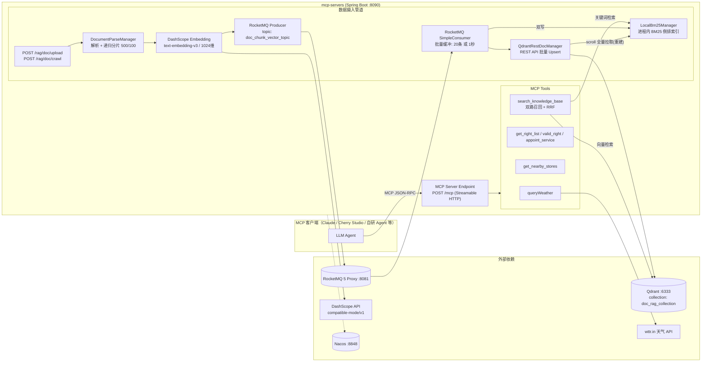

# mcp-servers — 基于 Spring AI 的 MCP 工具服务器（含 RAG 知识库检索）

[]() []() []() []()

## 1. 项目简介

本项目是一个基于 **Spring Boot 3 + Spring AI MCP Server** 构建的 **MCP（Model Context Protocol）工具服务器**，对外通过 **Streamable HTTP** 协议（端点 `/mcp`）向大模型客户端暴露一组可调用的 Tools（天气查询、权益预约、门店定位、知识库检索等）。

项目重点实现了 **健康科普知识库 RAG（Retrieval-Augmented Generation）场景**，完整覆盖「数据摄入 → 向量化 → 异步写入 → 多路召回检索」全链路：

- **摄入侧**：支持 PDF / Markdown / TXT 文件上传与网页 URL 抓取，经 LangChain4j 递归分片后调用 **DashScope text-embedding-v3** 向量化，投递 **RocketMQ 5** 削峰，消费端**批量聚合写入 Qdrant 向量库 + 进程内 BM25 索引双写**；
- **检索侧**：MCP 工具 `search_knowledge_base` 执行 **向量召回 + BM25 关键词召回双路并行**，任一路失败自动降级，最终以 **RRF（Reciprocal Rank Fusion）** 融合排序返回 TopK 上下文片段。

## 2. 整体架构



**核心数据流：**

1. **摄入**：`上传文件/URL` → 解析正文 → 递归分片（500 字符，重叠 100）→ 逐片 Embedding → RocketMQ → 消费端缓冲聚合 → 批量写入 Qdrant（point id = chunkId）+ 本地 BM25 索引双写；
2. **检索**：`用户问题` → 向量化后查 Qdrant（Top10）∥ BM25 关键词检索（Top10）→ 任一路失败自动降级单路 → RRF 融合（k=60）→ TopK（默认 3，上限 5）→ 拼装上下文返回给大模型。

## 3. 功能特性

| 特性 | 说明 |
| --- | --- |
| MCP Streamable HTTP 服务 | 端点 `POST /mcp`，keep-alive 30s，声明 tool / resource / prompt / completion 能力 |
| 注解式工具开发 | 基于 `@McpTool` / `@McpToolParam` 注解自动生成工具元数据（JSON Schema），方法即工具 |
| 结构化工具返回 | `McpSchema.CallToolResult` 同时携带 `text` 与 `structuredContent`，便于客户端渲染 |
| RAG 文档摄入 | 支持 PDF（Apache PDFBox）/ MD / TXT 上传、网页抓取（jsoup 正文提取，剔除 script/style/nav 等噪声） |
| 异步削峰写入 | RocketMQ 5 解耦"向量化"与"入库"，消费端内存缓冲聚合（20 条或 1 秒）批量写 Qdrant |
| 向量 + BM25 双写 | Qdrant point id 与 BM25 索引 key 统一使用 chunkId，保证 RRF 融合时可定位同一片段 |
| 多路召回 + RRF 融合 | 向量语义召回 + BM25 关键词召回，RRF（k=60）融合排序，双路命中者优先 |
| 召回降级兜底 | 任一路召回失败自动降级为另一路；双路均失败时返回友好提示，不抛异常 |
| 本地 BM25 全量重建 | 启动时从 Qdrant scroll 全量拉取构建索引；提供 `POST /rag/doc/rebuild-bm25` 手动重建 |
| 消息可靠性 | 消费失败不 ack，依靠 RocketMQ 不可见时间（30s）自动重投，超过最大重试次数进入死信钩子 |
| Nacos 延迟注册 | 规避 Nacos Client `STARTING` 时序 BUG 与 port=0 问题，就绪后延迟 2s 手动注册 |

## 4. 技术栈

| 类别 | 组件 | 版本 | 用途 |
| --- | --- | --- | --- |
| 语言/框架 | Java / Spring Boot | 17 / 3.3.4 | 基础运行时（parent POM） |
| MCP | spring-ai-starter-mcp-server-webmvc（Spring AI BOM） | 1.1.0-M3 | MCP Server 实现（WebMVC + Streamable HTTP） |
| 注册/配置中心 | spring-cloud-starter-alibaba-nacos-discovery / config | 2023.0.1.0 | 服务注册与配置导入 |
| 消息队列 | rocketmq-client-java | 5.2.2 | 文档向量消息异步削峰（SimpleConsumer 拉模式） |
| 向量库 | Qdrant（REST API 直连） | — | 向量存储与 ANN 检索（Cosine，1024 维） |
| LLM 编排 | dev.langchain4j（core / pdfbox / ollama / open-ai / dashscope） | 0.34.0 | 文档解析、递归分片、Embedding 抽象 |
| 向量模型 | 阿里云 DashScope `text-embedding-v3` | — | Query / Chunk 向量化（1024 维） |
| 网页抓取 | jsoup | 1.18.1 | 网页正文提取 |
| JSON | fastjson2 / jackson-databind | 2.0.40 / Boot 管理 | 天气 API 解析 / MQ 消息序列化 |
| 工具库 | Lombok、victools jsonschema-generator | 4.37.0 | 样板代码精简、JSON Schema 生成 |
| 测试 | spring-boot-starter-test + Mockito | — | 单元测试 |

## 5. 项目结构

```
src/main/java/com/jizuz/mcpserver
├── McpToolApplication.java          # 启动类（@EnableDiscoveryClient）
├── config
│   ├── EmbeddingConfig.java         # QwenEmbeddingModel（DashScope）Bean 定义
│   ├── NacosDelayedRegister.java    # 就绪后延迟 2s 手动注册 Nacos（规避时序 BUG）
│   └── RestTemplateConfig.java      # RestTemplate Bean
├── tools                            # ★ MCP 工具层（@McpTool 注解方法即工具）
│   ├── WeatherTool.java             # queryWeather：wttr.in 实时天气
│   ├── RightTool.java               # get_right_list / valid_right / appoint_service（口腔业务 Mock）
│   ├── LocationMapTool.java         # get_nearby_stores：附近门店（Mock）
│   └── RagTool.java                 # search_knowledge_base：双路召回 + RRF 融合检索
├── web
│   └── DocumentUploadController.java # /rag/doc/upload | /crawl | /rebuild-bm25
├── manager
│   ├── DocumentParseManager.java    # 文档解析 + 递归分片 + 逐片向量化 + 发 MQ
│   ├── WebCrawlManager.java         # jsoup 网页正文抓取（去噪）
│   ├── QdrantRestDocManager.java    # Qdrant REST：建集合/批量Upsert/删除/检索/scroll全量
│   └── LocalBm25Manager.java        # 进程内 BM25 索引（倒排表 + bigram 分词 + TF-IDF 打分）
├── mq
│   ├── producer
│   │   └── DocVectorProducer.java   # RocketMQ 5 Producer（topic: doc_chunk_vector_topic）
│   └── consumer
│       ├── BaseConsumer.java        # ★ 消费模板基类：拉取/解析/幂等/重试/死信/优雅关闭
│       ├── DocVectorQdrantConsumer.java # 批量缓冲刷盘 → Qdrant + BM25 双写
│       └── ConsumerStarter.java     # 容器启动/关闭时统一 init/destroy 所有消费者
└── models
    ├── AppointReq.java              # 预约请求 record
    └── mq
        └── DocChunkVectorMsg.java   # MQ 消息体（docId/chunkId/content/vector/fileName/...）

src/test/java/com/jizuz/mcpserver
├── tools/RagToolTest.java           # RRF 融合、降级、TopK 边界等 6 个用例
└── manager/LocalBm25ManagerTest.java # 分词、排序、删除、重建等 5 个用例
```

## 6. 方案详解

### 6.1 MCP Server 方案（Streamable HTTP）

基于 `spring-ai-starter-mcp-server-webmvc`，`application.yml` 中关键配置：

```yaml
spring:
  ai:
    mcp:
      server:
        enabled: true
        name: mcp-tool-server
        version: 1.0.0
        protocol: STREAMABLE            # Streamable HTTP 传输（替代旧 SSE 双端点方案）
        streamable-http:
          mcp-endpoint: /mcp            # 统一 JSON-RPC 端点（POST）
          keep-alive-interval: 30s      # 长连接保活心跳
        capabilities:
          tool: true                    # 声明支持的能力
          resource: true
          prompt: true
          completion: true
```

要点：

- **单端点双语义**：Streamable HTTP 中客户端所有 JSON-RPC 请求（`initialize` / `tools/list` / `tools/call` …）都 `POST` 到 `/mcp`；服务端可通过 SSE 流式返回，keep-alive 间隔 30s；
- **注解驱动**：工具类为普通 `@Component`，方法上标注 `@McpTool`、参数上标注 `@McpToolParam`，框架启动时扫描并生成 MCP 工具元数据（含参数 JSON Schema），无需手写 Schema；
- **工具提示词工程**：`RagTool.search_knowledge_base` 的 `description` 明确写了「何时调用 / 何时不调用 / 不要编造」，用于约束大模型的工具选择行为；同时通过 `@McpTool.McpAnnotations` 声明 `readOnlyHint=true`、`idempotentHint=true`、`destructiveHint=false`，向客户端声明只读幂等语义。

### 6.2 MCP 工具一览

| 工具名 | 实现类 | 功能 | 参数 | 数据来源 |
| --- | --- | --- | --- | --- |
| `queryWeather` | `WeatherTool` | 查询城市实时天气（天气状况/温度/风速/湿度），异常时返回友好提示 | `city`：城市中文名 | wttr.in 公开 API（JSON） |
| `get_right_list` | `RightTool` | 查询用户权益卡列表 | `userId` | Mock 数据（口腔洁牙卡场景） |
| `valid_right` | `RightTool` | 校验权益是否可用（库存校验 Mock） | `rightId` | Mock |
| `appoint_service` | `RightTool` | 提交预约（姓名/手机/时间/权益ID） | `AppointReq` record 复合参数 | Mock |
| `get_nearby_stores` | `LocationMapTool` | 查询附近门店（店名/交通/距离） | `location` | Mock |
| `search_knowledge_base` | `RagTool` | 健康科普知识库双路召回检索（见 6.4） | `query`（必填）、`topK`（1~5，默认 3） | Qdrant + 本地 BM25 |

> `RightTool` / `LocationMapTool` 为业务演示用 Mock，展示了返回结构化内容（`structuredContent`）与复合 record 参数两种进阶用法，可按同样模式替换为真实业务 RPC/DB 调用。

### 6.3 RAG 数据摄入管道（异步、削峰、可靠）

```
POST /rag/doc/upload (pdf/md/txt)          POST /rag/doc/crawl?url=
        └────────────┬──────────────────────────┘
                     ▼
        DocumentParseManager.parseAndSend / parseWebPageAndSend
          1) 解析：PDF → ApachePdfBoxDocumentParser；MD/TXT → 纯文本；
             网页 → WebCrawlManager（jsoup，移除 script/style/noscript/nav/footer/aside，
             提取 p,h1~h6,li 正文，10s 超时，UA 伪装）
          2) 分片：DocumentSplitters.recursive(500, 100)
             （按段落→句子→词递归切分，块间重叠 100 字符保留上下文连贯性）
          3) 向量化：逐片调用 QwenEmbeddingModel（DashScope text-embedding-v3，1024 维）
          4) 组装 DocChunkVectorMsg（docId=UUID、chunkId=UUID、content、vector、fileName、docType）
                     ▼
        DocVectorProducer → RocketMQ topic=doc_chunk_vector_topic, tag=vector_write
                     ▼
        DocVectorQdrantConsumer（SimpleConsumer 拉模式，单线程拉取循环）
          5) consume()：消息放入内存 BlockingQueue 缓冲；
             积压 ≥ 20 条立即刷盘，否则由定时任务每 1000ms 刷盘
          6) flushBuffer()：drainTo 批量 → QdrantRestDocManager.batchUpsert()
             （PUT /collections/{c}/points，point.id = chunkId）
          7) 成功后双写 LocalBm25Manager.addChunks()（增量更新倒排索引）
```

**设计要点：**

- **为什么引入 MQ**：上传大文档会产生成百上千个 chunk，若同步逐条写 Qdrant 会阻塞上传线程且容易打垮向量库；RocketMQ 在"向量化完成"与"入库"之间削峰，并天然提供失败重投；
- **批量聚合**：消费端不是收到一条写一条，而是内存缓冲后按「20 条或 1 秒」批量 Upsert，显著降低 Qdrant HTTP 请求次数；
- **双写一致性**：Qdrant 写入成功后才写 BM25；BM25 为进程内缓存性质，即使丢失也可随时从 Qdrant 全量重建；
- **chunkId 双重身份**：既是 Qdrant point id，又是 BM25 索引 key，这是 RRF 融合能把两路结果对齐到同一片段的前提。

### 6.4 RAG 检索方案（双路召回 + 降级 + RRF 融合）

`RagTool.searchKnowledgeBase(query, topK)` 执行流程：

```
query（用户健康科普问题）
   │
   ├─ 路1 向量召回：embed(query) → Qdrant /points/search（limit=vectorTopN=10）
   │     语义泛化召回：能命中"同义不同词"的片段（如"胃疼"≈"上腹痛"）
   │
   ├─ 路2 关键词召回：LocalBm25Manager.search(query, bm25TopN=10)
   │     精确词面召回：专有名词、药品名、缩写等向量易漂移的场景
   │
   ├─ 两路各自 try/catch：任一路异常 → 置失败标志，自动降级为另一路
   │   双路全失败 → 返回"知识库检索失败，请稍后重试"
   │   双路均空结果 → 返回"未检索到相关内容，请换个问法或先上传文档"
   │
   ▼
RRF 融合排序（k = 60）
   score(d) = Σ_i  1 / (k + rank_i(d))     rank 从 1 计
   同一 chunkId 在两路都出现 → 两项相加 → 天然排到最前
   │
   ▼
按 rrfScore 降序取 TopK（默认 3，clamp 到 [1,5]）
拼装文本上下文（含 RRF/向量/BM25 得分、命中来源、文件来源、片段正文）→ 返回给大模型
```

**返回示例（工具输出格式）：**

```
====知识库多路召回结果（向量+BM25，RRF融合 k=60）====
（提示：向量召回暂不可用，本次仅BM25关键词召回）
【RRF:0.0164 向量:- BM25:9.4821 命中:关键词 来源:胃炎护理.md】
胃炎是胃黏膜的炎症反应，典型症状包括上腹痛、腹胀……

【RRF:0.0328 向量:0.9123 BM25:8.1005 命中:向量+关键词 来源:健康科普.pdf】
……
```

**为什么选 RRF 而非加权分数融合**：向量相似度（0~1 的 Cosine）与 BM25 分数量纲完全不同，直接加权需要精细调参；RRF 只利用排名信息，无需归一化，对 k（取标准值 60）不敏感，是多路召回融合的工业界标准做法。

### 6.5 本地 BM25 实现细节（LocalBm25Manager）

进程内纯 Java 实现的 BM25 检索引擎，无任何外部依赖（不引 Elasticsearch）：

**打分公式**（k1=1.2，b=0.75，经典参数）：

```
score(D,Q) = Σ_t∈Q  IDF(t) · tf(t,D)·(k1+1) / ( tf(t,D) + k1·(1 − b + b·|D|/avgdl) )

IDF(t) = ln( 1 + (N − df + 0.5) / (df + 0.5) )
其中 N=索引文档总数，df=包含词元 t 的文档数，|D|=文档 token 数，avgdl=平均文档长度
```

**中英文混合分词策略**（`tokenize()`）：

- 中文（Unicode HAN 脚本）：**滑动二元组（bigram）**，"胃炎症状" → `胃炎`、`炎症`、`状`… 相邻汉字两两组合，避免词典依赖，召回率好；
- 英文/数字：连续字母数字段作为独立词元，统一小写归一化，"Gastritis2024" → `gastritis`、`2024`。

**数据结构与生命周期：**

| 结构 | 说明 |
| --- | --- |
| `docMap: Map<pointId, Bm25Doc>` | 正排：chunkId → {docId, content, fileName, docType, 词频表 tf, 长度} |
| `postings: Map<term, Set<pointId>>` | 倒排：词元 → chunkId 集合，检索时按查询词元取交集候选 |
| `avgDocLen` | 全体文档平均长度，每次增删后重算 |

- **启动**：`ApplicationReadyEvent` 时调 `rebuildFromQdrant()` 从 Qdrant scroll 全量拉取构建（每页 256 条，不含向量，仅 payload）；Qdrant 不可用时仅 warn 不阻断启动；
- **增量**：MQ 消费成功写入 Qdrant 后 `addChunks()` 双写；同 chunkId 重复写入会先移除旧索引再重建（幂等）；
- **删除**：`removeByDocId()` 与 `QdrantRestDocManager.deleteByDocId()` 对应；
- **线程安全**：所有公开方法 `synchronized`；
- **手动重建**：`POST /rag/doc/rebuild-bm25`。

### 6.6 消息可靠性设计（BaseConsumer 模板）

`BaseConsumer<T>` 封装了 RocketMQ 5 `SimpleConsumer` 拉模式消费的完整骨架，子类只需实现 5 个抽象方法（`getTypeReference`/`consume`/`getTopic`/`getConsumerGroup`/`getProxyEndpoint`）：

- **拉取循环**：单线程 `while(running)` 调 `simpleConsumer.receive(batchNum, invisibleDuration)`，批量拉取（默认 10 条）；
- **消费模板**：`前置过滤 preFilter → 幂等校验 idempotentCheck → 反序列化 parseMessage → 业务 consume → 幂等标记 markIdempotent → ack`；
- **失败重试语义**：消费抛异常时 **不 ack**，消息对 broker 保持"不可见"（30s），超时后自动重投；通过 `MessageView.getDeliveryAttempt()` 判断重试次数，超过 `getMaxRetryTimes()`（默认 3）则 ack 丢弃并触发 `handleDeadLetter()` 死信钩子（可扩展接告警/落库）；
- **主动跳过**：业务可抛 `SkipMessageException` 直接 ack 放弃该消息；
- **生命周期**：`ConsumerStarter` 监听 `ContextRefreshedEvent` / `ContextClosedEvent` 统一 init/destroy 所有消费者，init 失败仅记日志不阻断应用启动；
- **订阅表达式**：必须在 `newSimpleConsumerBuilder().build()` 之前通过 `setSubscriptionExpressions` 设置（rocketmq-client-java 5.x API 强制要求，代码中有注释说明）。

**DocVectorQdrantConsumer 的失败处理链**：批量 Upsert 失败 → 逐条 `upsertSingle` 重试 → 单条仍失败抛 RuntimeException → 触发 MQ 层面的"不 ack + 30s 后重投"，三层兜底保证最终写入 Qdrant。

### 6.7 Nacos 延迟注册方案

`application.yml` 中 `spring.cloud.nacos.discovery.register-enabled: false` 关闭自动注册，改由 `NacosDelayedRegister` 在 `ApplicationReadyEvent`（应用完全就绪）后：

1. `Thread.sleep(2000)` —— 彻底避开 Nacos Client 启动初期 `STARTING` 状态下注册失败的时序 BUG；
2. `registration.setPort(serverPort)` —— 强制使用 yml 固定端口，杜绝 `port=0`（随机端口）注册上去的问题；
3. `registry.register(registration)` —— 手动执行注册。

该方案保证：只有 MCP 端点真正可用后服务才出现在 Nacos 上，避免上游过早路由流量。

### 6.8 Qdrant REST 交互细节（QdrantRestDocManager）

不依赖 Qdrant Java SDK，直接以 RestTemplate 调 REST API（`http://127.0.0.1:6333`）：

| 方法 | HTTP | 端点 | 说明 |
| --- | --- | --- | --- |
| `initCollection()` | GET / PUT | `/collections/{name}` | 先 GET 探测；404 则 PUT 创建（`vectors.size=1024`，`distance=Cosine`） |
| `batchUpsert(list)` | PUT | `/collections/{name}/points` | 批量写入；`point.id = chunkId`，payload 含 docId/chunkId/content/fileName/pageNum/docType |
| `upsertSingle(msg)` | PUT | 同上 | 单条写入（内部复用 batchUpsert），用于批量失败后的逐条重试 |
| `deleteByDocId(docId)` | POST | `/collections/{name}/points/delete` | 按 payload 过滤器（`must: [{key: docId, match}]`）批量删除，用于文档更新/下线 |
| `search(vector, topN)` | POST | `/collections/{name}/points/search` | 向量近邻检索，`with_payload=true` 带回原文，RAG 查询主路径 |
| `scrollAllPoints()` | POST | `/collections/{name}/points/scroll` | 分页全量拉取（`limit=256`、`with_vector=false`），供 BM25 全量重建 |

**payload 设计**：向量库不仅是"向量容器"，content/fileName 等业务字段随 payload 存储，检索结果可直接还原原文上下文，无需回查源文档。

## 7. 配置说明（application.yml）

| 配置项 | 默认值 | 说明 |
| --- | --- | --- |
| `server.port` | `8090` | HTTP 端口（MCP 端点与 RAG 管理接口共用） |
| `spring.ai.mcp.server.protocol` | `STREAMABLE` | MCP 传输协议 |
| `spring.ai.mcp.server.streamable-http.mcp-endpoint` | `/mcp` | MCP JSON-RPC 端点 |
| `spring.ai.mcp.server.streamable-http.keep-alive-interval` | `30s` | 流式响应保活间隔 |
| `spring.cloud.nacos.*` | `127.0.0.1:8848` | 注册/配置中心地址；`register-enabled: false` 关闭自动注册 |
| `weather.api-url` | `https://wttr.in/%s?format=j1&lang=zh` | 天气查询 API 模板（`%s` 占位城市名） |
| `rocketmq.proxy-endpoint` | `127.0.0.1:8081` | RocketMQ 5 Proxy（gRPC）地址 |
| `qdrant.rest-url` | `http://127.0.0.1:6333` | Qdrant REST 地址 |
| `qdrant.collection-name` | `doc_rag_collection` | 向量集合名 |
| `qdrant.embedding-dimension` | `1024` | 向量维度（须与 embedding 模型输出一致） |
| `dashscope.api-key` | — | 阿里云 DashScope API Key（**建议改为环境变量注入，勿提交明文**） |
| `dashscope.embedding-model` | `text-embedding-v3` | 向量模型（1024 维） |
| `dashscope.base-url` | `https://dashscope.aliyuncs.com/compatible-mode/v1` | OpenAI 兼容模式地址 |
| `embedding.chunk.size` / `overlap` | `500` / `100` | 分片长度与相邻块重叠字符数 |
| `rag.recall.vector-top-n` | `10` | 向量召回条数 |
| `rag.recall.bm25-top-n` | `10` | BM25 关键词召回条数 |
| `rag.recall.rrf-k` | `60` | RRF 平滑常数（标准值 60） |

## 8. 快速开始

### 8.1 环境依赖

| 中间件 | 默认地址 | 用途 | 备注 |
| --- | --- | --- | --- |
| Qdrant | `127.0.0.1:6333` | 向量库 | `docker run -p 6333:6333 qdrant/qdrant` |
| RocketMQ 5（Proxy） | `127.0.0.1:8081` | 消息队列 | 需 5.x 并开启 Proxy；提前创建 topic `doc_chunk_vector_topic` |
| Nacos | `127.0.0.1:8848` | 注册/配置中心 | 可选；`config.import: optional:nacos` 缺失不阻断启动 |
| DashScope API Key | — | 向量化 | 阿里云百炼控制台获取，替换 yml 中的 `dashscope.api-key` |
| JDK 17+ / Maven 3.8+ | — | 构建运行 | |

### 8.2 构建与启动

```bash
# 编译（跳过测试）
mvn clean package -DskipTests

# 启动
java -jar target/mcp-servers-1.0.0.jar
# 或开发模式
mvn spring-boot:run
```

启动成功日志标志：`MCP server started!`、`BM25索引初始化完成`、`[RocketMQ SimpleConsumer Init] group=doc-qdrant-write-group`。

### 8.3 灌入知识库文档

```bash
# 上传 PDF / MD / TXT
curl -X POST http://127.0.0.1:8090/rag/doc/upload -F "file=@./胃炎护理指南.pdf"

# 抓取网页并向量化
curl -X POST "http://127.0.0.1:8090/rag/doc/crawl?url=https://example.com/health-article"

# 手动重建本地 BM25 索引（如怀疑索引缺失）
curl -X POST http://127.0.0.1:8090/rag/doc/rebuild-bm25
```

### 8.4 MCP 客户端接入

通用客户端配置（Claude Desktop / Cherry Studio / Cursor 等支持 Streamable HTTP 的客户端）：

```json
{
  "mcpServers": {
    "mcp-tool-server": {
      "url": "http://127.0.0.1:8090/mcp"
    }
  }
}
```

使用 curl 手工验证 MCP 协议（Streamable HTTP 需先 initialize 拿会话，再调用）：

```bash
# 1) initialize —— 响应头中返回 Mcp-Session-Id
curl -s -D headers.txt -X POST http://127.0.0.1:8090/mcp \
  -H "Content-Type: application/json" \
  -d '{"jsonrpc":"2.0","id":1,"method":"initialize","params":{"protocolVersion":"2025-03-26","capabilities":{},"clientInfo":{"name":"curl","version":"1.0"}}}'

# 2) initialized 通知 + 后续请求需携带会话头
SID=$(grep -i mcp-session-id headers.txt | awk '{print $2}' | tr -d '\r')

curl -s -X POST http://127.0.0.1:8090/mcp \
  -H "Content-Type: application/json" -H "Mcp-Session-Id: $SID" \
  -d '{"jsonrpc":"2.0","method":"notifications/initialized"}'

# 3) 列出工具
curl -s -X POST http://127.0.0.1:8090/mcp \
  -H "Content-Type: application/json" -H "Mcp-Session-Id: $SID" \
  -d '{"jsonrpc":"2.0","id":2,"method":"tools/list"}'

# 4) 调用知识库检索工具
curl -s -X POST http://127.0.0.1:8090/mcp \
  -H "Content-Type: application/json" -H "Mcp-Session-Id: $SID" \
  -d '{"jsonrpc":"2.0","id":3,"method":"tools/call","params":{"name":"search_knowledge_base","arguments":{"query":"胃炎有哪些症状","topK":3}}}'
```

## 9. 单元测试

项目自带 11 个纯 Mock 单测（不依赖任何外部中间件，可直接运行）：

**`RagToolTest`（6 个用例）——覆盖检索全链路分支：**

| 用例 | 验证点 |
| --- | --- |
| `rrfFusionPreferDualHit` | 向量/BM25 排名不一致时，双路命中的片段经 RRF 融合后应排在单路命中之前；BM25 独有结果保留 |
| `degradeToBm25WhenEmbeddingFail` | Embedding 服务异常（如欠费）时自动降级为仅 BM25 召回，输出含降级提示 |
| `bothRecallFail` | 双路均异常时返回"均不可用"友好提示而非抛异常 |
| `emptyResult` | 双路均无命中时返回"未检索到相关内容" |
| `topKBoundary` | topK>5 截断为 5、非法值重置默认 3、topK=2 仅保留 RRF 最高的前 2 条 |
| `blankQuery` | 空白查询直接返回参数错误提示 |

**`LocalBm25ManagerTest`（5 个用例）——覆盖 BM25 引擎本身：**

| 用例 | 验证点 |
| --- | --- |
| `tokenize_cnBigramAndEnWord` | 中文 bigram、英文小写化、数字词元 |
| `search_rankMostRelevantFirst` | 多词元命中的文档 BM25 得分最高、排序正确 |
| `search_emptyQueryOrNoHit` | 空查询与无命中返回空列表 |
| `removeByDocId` | 按 docId 删除该文档全部片段，其余文档保留 |
| `rebuildFromQdrant` | 从 Qdrant scroll 结果全量重建索引并可检索 |

运行：

```bash
mvn test
```

## 10. 注意事项与已知限制

1. **API Key 安全**：`application.yml` 中当前明文存放了 DashScope API Key，生产环境务必改为 `${DASHSCOPE_API_KEY}` 环境变量或 Nacos 加密配置，并从 Git 历史中清除；建议尽快在阿里云控制台**轮换该 Key**。
2. **BM25 索引为进程内状态**：多实例水平扩容时各实例 BM25 索引独立，任一实例可用 `/rag/doc/rebuild-bm25` 从 Qdrant 对齐；数据权威源始终是 Qdrant。
3. **上传接口为同步分片 + 同步向量化**：大 PDF（上千分片）时 HTTP 请求耗时较长，生产建议改为异步任务 + 批量 Embedding 接口（DashScope 支持批量）。
4. **消费缓冲为内存队列**：实例宕机时缓冲中未刷盘消息依靠 RocketMQ 30s 不可见超时自动重投，不丢数据；`flushExecutor` 定时线程若因异常终止，需依赖 MQ 重投兜底。
5. **`deleteByDocId` 尚未接入 Controller**：`QdrantRestDocManager` / `LocalBm25Manager` 已具备按文档删除能力，可作为后续文档更新/下线功能的扩展点。
6. **Mock 工具**：`RightTool`、`LocationMapTool` 返回写死数据，仅作接入示范。
7. **Spring AI 版本为里程碑版**（1.1.0-M3），API 可能随正式版调整，升级需回归测试。

## 11. 后续可扩展方向

- Rerank 精排：RRF 融合后接入 DashScope `gte-rerank` 对 TopK 重排；
- 文档更新链路：同 docId 重新上传时先 `deleteByDocId` 再写入，实现版本替换；
- 检索结果缓存 / 查询改写（HyDE）、引用溯源（返回 fileName + pageNum 供前端标注来源）;
- MCP Resources / Prompts 能力落地（当前仅声明 capability，未注册具体资源与提示模板）。

---

持续更新中。。。
